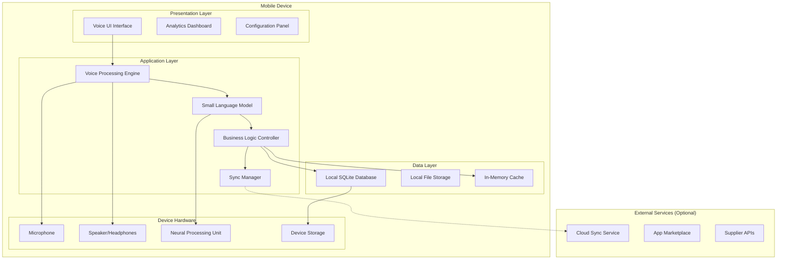

# Design Document: Micro-Retailer Intelligent Assistant

## Overview

The Micro-Retailer Intelligent Assistant is an offline-first mobile application that leverages on-device Small Language Models (SLMs) to provide voice-driven inventory management for micro-retailers. The system architecture prioritizes local processing, data privacy, and functionality in low-connectivity environments while maintaining responsive performance on resource-constrained devices.

The application employs a layered architecture with clear separation between voice processing, natural language understanding, business logic, and data persistence. All core functionality operates without internet connectivity, with optional cloud synchronization for backup and advanced analytics.

## Architecture

### High-Level Architecture



### Component Architecture

The system follows a modular architecture with five primary components:

1. **Voice Processing Engine**: Handles speech-to-text conversion and text-to-speech output using on-device models
2. **Small Language Model**: Processes natural language queries and generates intelligent responses
3. **Business Logic Controller**: Manages inventory operations, analytics, and business rules
4. **Data Management Layer**: Handles local storage, caching, and optional synchronization
5. **User Interface Layer**: Provides voice-first interaction with visual feedback and dashboard capabilities

## Components and Interfaces

### Voice Processing Engine

**Responsibilities:**
- Real-time speech-to-text conversion using on-device models
- Text-to-speech synthesis for system responses
- Audio preprocessing and noise reduction
- Voice activity detection and wake word recognition

**Key Interfaces:**
```typescript
interface VoiceEngine {
  startListening(): Promise<void>
  stopListening(): Promise<string>
  synthesizeSpeech(text: string): Promise<AudioBuffer>
  isListening(): boolean
  setLanguage(language: string): void
}

interface AudioProcessor {
  processAudio(audioBuffer: AudioBuffer): Promise<string>
  enhanceAudio(audioBuffer: AudioBuffer): AudioBuffer
  detectVoiceActivity(audioBuffer: AudioBuffer): boolean
}
```

**Implementation Details:**
- Uses optimized Whisper models (Large-V3-Turbo) for speech recognition
- Implements WebRTC VAD for voice activity detection
- Supports multiple Indian languages and English
- Maintains audio processing pipeline with noise reduction

### Small Language Model Integration

**Responsibilities:**
- Natural language understanding for inventory queries
- Intent classification and entity extraction
- Context-aware response generation
- Query optimization and caching

**Key Interfaces:**
```typescript
interface SLMProcessor {
  processQuery(query: string, context: QueryContext): Promise<SLMResponse>
  extractEntities(query: string): Promise<Entity[]>
  classifyIntent(query: string): Promise<Intent>
  generateResponse(intent: Intent, entities: Entity[], data: any): Promise<string>
}

interface QueryContext {
  previousQueries: string[]
  currentInventory: InventorySnapshot
  userPreferences: UserPreferences
  sessionId: string
}
```

**Implementation Details:**
- Utilizes compressed 7B parameter models (Llama 3.2, Phi-3) with ternary weights
- Runs within 2GB memory footprint using quantization techniques
- Implements context window management for conversation continuity
- Supports domain-specific fine-tuning for retail terminology

### Business Logic Controller

**Responsibilities:**
- Inventory management operations (add, update, query, delete)
- Smart reorder calculations and recommendations
- Customer promotion logic and optimization
- Analytics computation and reporting
- Credit (Udhar) tracking and management

**Key Interfaces:**
```typescript
interface InventoryManager {
  queryStock(productQuery: string): Promise<StockResult[]>
  updateStock(productId: string, quantity: number, operation: StockOperation): Promise<void>
  addProduct(product: Product): Promise<string>
  getStockAlerts(): Promise<StockAlert[]>
}

interface ReorderEngine {
  calculateReorderSuggestions(): Promise<ReorderSuggestion[]>
  updateReorderRules(rules: ReorderRule[]): Promise<void>
  processAutomaticReorders(): Promise<ReorderResult[]>
}

interface PromotionEngine {
  generatePromotions(criteria: PromotionCriteria): Promise<Promotion[]>
  activatePromotion(promotionId: string): Promise<void>
  trackPromotionEffectiveness(promotionId: string): Promise<PromotionMetrics>
}
```

### Data Management Layer

**Responsibilities:**
- Local SQLite database operations
- File-based storage for media and documents
- In-memory caching for performance optimization
- Data synchronization queue management
- Backup and restore operations

**Key Interfaces:**
```typescript
interface DataStore {
  query<T>(sql: string, params: any[]): Promise<T[]>
  execute(sql: string, params: any[]): Promise<void>
  transaction(operations: DatabaseOperation[]): Promise<void>
  backup(): Promise<BackupResult>
}

interface SyncManager {
  queueOperation(operation: SyncOperation): Promise<void>
  syncWhenOnline(): Promise<SyncResult>
  resolveConflicts(conflicts: DataConflict[]): Promise<void>
  getQueueStatus(): SyncQueueStatus
}
```

## Data Models

### Core Entities

**Product Model:**
```typescript
interface Product {
  id: string
  name: string
  category: string
  barcode?: string
  costPrice: number
  sellingPrice: number
  currentStock: number
  minStockLevel: number
  maxStockLevel: number
  unit: string
  supplier?: Supplier
  lastUpdated: Date
  isActive: boolean
}
```

**Transaction Model:**
```typescript
interface Transaction {
  id: string
  type: 'sale' | 'purchase' | 'adjustment' | 'return'
  customerId?: string
  items: TransactionItem[]
  totalAmount: number
  paymentMethod: 'cash' | 'credit' | 'digital'
  timestamp: Date
  notes?: string
}

interface TransactionItem {
  productId: string
  quantity: number
  unitPrice: number
  discount?: number
}
```

**Customer Credit Model:**
```typescript
interface CustomerCredit {
  customerId: string
  customerName: string
  phoneNumber?: string
  totalCredit: number
  creditLimit: number
  transactions: CreditTransaction[]
  lastPayment?: Date
  status: 'active' | 'suspended' | 'closed'
}

interface CreditTransaction {
  id: string
  amount: number
  type: 'credit_given' | 'payment_received'
  description: string
  timestamp: Date
  relatedTransactionId?: string
}
```

### Database Schema

The local SQLite database implements the following schema:

```sql
-- Products table
CREATE TABLE products (
  id TEXT PRIMARY KEY,
  name TEXT NOT NULL,
  category TEXT,
  barcode TEXT UNIQUE,
  cost_price REAL NOT NULL,
  selling_price REAL NOT NULL,
  current_stock INTEGER DEFAULT 0,
  min_stock_level INTEGER DEFAULT 0,
  max_stock_level INTEGER,
  unit TEXT DEFAULT 'piece',
  supplier_id TEXT,
  created_at DATETIME DEFAULT CURRENT_TIMESTAMP,
  updated_at DATETIME DEFAULT CURRENT_TIMESTAMP,
  is_active BOOLEAN DEFAULT 1
);

-- Transactions table
CREATE TABLE transactions (
  id TEXT PRIMARY KEY,
  type TEXT NOT NULL CHECK (type IN ('sale', 'purchase', 'adjustment', 'return')),
  customer_id TEXT,
  total_amount REAL NOT NULL,
  payment_method TEXT CHECK (payment_method IN ('cash', 'credit', 'digital')),
  timestamp DATETIME DEFAULT CURRENT_TIMESTAMP,
  notes TEXT,
  sync_status TEXT DEFAULT 'pending'
);

-- Customer credits table
CREATE TABLE customer_credits (
  customer_id TEXT PRIMARY KEY,
  customer_name TEXT NOT NULL,
  phone_number TEXT,
  total_credit REAL DEFAULT 0,
  credit_limit REAL DEFAULT 0,
  last_payment DATETIME,
  status TEXT DEFAULT 'active' CHECK (status IN ('active', 'suspended', 'closed')),
  created_at DATETIME DEFAULT CURRENT_TIMESTAMP
);
```

Now I need to use the prework tool to analyze the acceptance criteria before writing the Correctness Properties section.

<function_calls>
<invoke name="prework">
<parameter name="featureName">micro-retailer-assistant

## Correctness Properties

*A property is a characteristic or behavior that should hold true across all valid executions of a system—essentially, a formal statement about what the system should do. Properties serve as the bridge between human-readable specifications and machine-verifiable correctness guarantees.*

The following properties define the correctness requirements for the Micro-Retailer Intelligent Assistant, derived from the acceptance criteria and designed for property-based testing validation.

### Property 1: Voice Processing Locality
*For any* voice query submitted to the system, all processing including speech recognition, natural language understanding, and response generation should occur entirely on-device without external network calls, regardless of network connectivity status.
**Validates: Requirements 2.1, 2.4, 3.1, 3.5, 8.4**

### Property 2: Query Response Performance
*For any* voice query or stock check operation, the system should provide initial response within specified time limits (2 seconds for voice queries, 3 seconds for stock checks up to 10,000 items) while maintaining performance during concurrent operations.
**Validates: Requirements 3.2, 10.1, 10.2, 10.5**

### Property 3: Natural Language Understanding
*For any* valid natural language query about inventory, the SLM should correctly identify requested items and retrieve appropriate stock information, maintaining context awareness across conversation sequences.
**Validates: Requirements 2.2, 2.3, 3.3**

### Property 4: Stock Alert Generation
*For any* product with stock levels below defined thresholds, the system should generate appropriate warnings, reorder suggestions, or promotional recommendations based on the specific stock condition and business rules.
**Validates: Requirements 2.5, 4.1, 5.1**

### Property 5: Reorder Intelligence
*For any* inventory analysis request, the system should generate reorder suggestions that consider stock patterns, seasonal trends, sales velocity, and configured business rules, with recommendations varying appropriately based on input data.
**Validates: Requirements 4.2, 4.4, 4.5**

### Property 6: Promotion Optimization
*For any* promotional opportunity detection, the system should recommend discount parameters and track effectiveness while respecting profit margins and inventory turnover constraints, with personalized offers based on customer patterns.
**Validates: Requirements 5.2, 5.3, 5.4, 5.5**

### Property 7: Analytics Completeness
*For any* analytics request, the dashboard should display all required metrics (daily/weekly/monthly performance, inventory turnover, profit margins, trend analysis) using locally stored data, functioning identically whether online or offline.
**Validates: Requirements 6.1, 6.2, 6.3, 6.5**

### Property 8: Credit Transaction Integrity
*For any* credit transaction or payment, the system should accurately record all required details, maintain correct customer balances, generate appropriate alerts when limits are approached, and update records consistently when payments are received.
**Validates: Requirements 7.1, 7.2, 7.3, 7.5**

### Property 9: Data Privacy and Local Storage
*For any* business data generated or processed by the system, it should be stored locally by default without external transmission, with data export maintaining encryption standards and no sensitive data transmitted without explicit authorization.
**Validates: Requirements 8.1, 8.3, 8.5**

### Property 10: Synchronization Security
*For any* data synchronization operation, the system should use encrypted connections, obtain explicit user consent, queue operations appropriately during offline periods, and sync automatically when connectivity is restored.
**Validates: Requirements 6.4, 8.2, 9.2, 9.4**

### Property 11: Offline Functionality Completeness
*For any* core system operation (voice processing, stock management, analytics), full functionality should be available without internet connectivity, with clear status indication and data consistency maintained throughout offline periods.
**Validates: Requirements 9.1, 9.3, 9.5**

### Property 12: System Performance on Minimum Hardware
*For any* system operation on devices meeting minimum specifications (2GB RAM, basic processors), the application should start within 5 seconds and maintain responsive performance without degradation.
**Validates: Requirements 10.3, 10.4**

### Property 13: Conditional Online Features
*For any* optional online feature (automatic order placement, cloud sync), the system should detect connectivity availability and offer appropriate functionality while maintaining full offline operation when connectivity is unavailable.
**Validates: Requirements 4.3**

### Property 14: Payment Reminder Generation
*For any* customer with outstanding credit balances, the system should generate payment reminders and overdue notifications based on configured payment terms and due dates.
**Validates: Requirements 7.4**

## Error Handling

### Voice Processing Errors
- **Audio Input Failures**: System gracefully handles microphone access issues, audio quality problems, and hardware failures
- **Speech Recognition Errors**: Provides fallback mechanisms for unclear speech, background noise, and unsupported languages
- **SLM Processing Errors**: Handles model loading failures, memory constraints, and processing timeouts

### Data Management Errors
- **Database Corruption**: Implements automatic backup restoration and data integrity verification
- **Storage Limitations**: Manages disk space constraints with data archiving and cleanup procedures
- **Sync Conflicts**: Resolves data conflicts using timestamp-based resolution and user confirmation

### Network and Connectivity Errors
- **Intermittent Connectivity**: Queues operations and retries with exponential backoff
- **Sync Failures**: Maintains operation logs and provides manual sync options
- **API Timeouts**: Implements circuit breaker patterns for external service calls

### Business Logic Errors
- **Invalid Transactions**: Validates all business operations before execution
- **Credit Limit Violations**: Prevents transactions exceeding configured limits
- **Inventory Inconsistencies**: Implements reconciliation procedures for stock discrepancies

## Testing Strategy

### Dual Testing Approach

The system employs both unit testing and property-based testing to ensure comprehensive coverage:

**Unit Tests** focus on:
- Specific examples demonstrating correct behavior
- Edge cases and error conditions
- Integration points between components
- Database operations and data transformations

**Property-Based Tests** focus on:
- Universal properties holding across all inputs
- Comprehensive input coverage through randomization
- Business rule validation across diverse scenarios
- Performance characteristics under varying conditions

### Property-Based Testing Configuration

- **Testing Framework**: Fast-check for TypeScript/JavaScript implementation
- **Test Iterations**: Minimum 100 iterations per property test
- **Test Tagging**: Each property test references its design document property using format: **Feature: micro-retailer-assistant, Property {number}: {property_text}**
- **Generator Strategy**: Smart generators that constrain inputs to realistic business scenarios

### Testing Categories

**Voice Processing Tests**:
- Property tests for speech recognition accuracy across accents and languages
- Unit tests for audio preprocessing and noise reduction
- Performance tests for response time requirements

**Business Logic Tests**:
- Property tests for inventory calculations and stock management
- Unit tests for specific business rules and edge cases
- Integration tests for component interactions

**Data Management Tests**:
- Property tests for data consistency and integrity
- Unit tests for database operations and migrations
- Sync tests for conflict resolution scenarios

**Performance Tests**:
- Property tests for response time requirements across varying loads
- Unit tests for memory usage and resource optimization
- Stress tests for concurrent operation handling

The testing strategy ensures that both specific examples work correctly (unit tests) and universal properties hold across all possible inputs (property tests), providing confidence in system correctness and reliability.